# MizeKar - Fullscreen Windows Folder Manager

A modern, fullscreen Windows desktop application for managing folder structures with Persian language support, category-based organization, and image display capabilities.

## 🚀 Features

- **Fullscreen Experience** - True fullscreen window with no title bars or borders
- **Persian Language Support** - Full UTF-8 support for Persian folder names and UI elements with Shabnam font
- **Category-Based Organization** - 9 main categories in 3x3 grid layout for structured folder management
- **Dynamic Folder Management** - Real-time updates when folders are added or deleted
- **Input Validation** - Persian-only input with visual feedback for invalid characters
- **Custom Dialogs** - Professional Persian-styled dialogs for all user interactions
- **Intuitive Interface** - Clean, modern UI with smooth navigation
- **File System Integration** - Direct integration with Windows Explorer
- **Image Display System** - Special category for displaying and uploading chart images
- **Empty State Handling** - User-friendly messages when categories have no folders
- **Custom Application Icon** - Professional icon for Windows integration

## 📸 Screenshots

### Application Flow

| Screen | Description | Screenshot |
|--------|-------------|------------|
| **Splash Screen** | Displays for 2 seconds with app branding<br>Automatic transition to main screen | 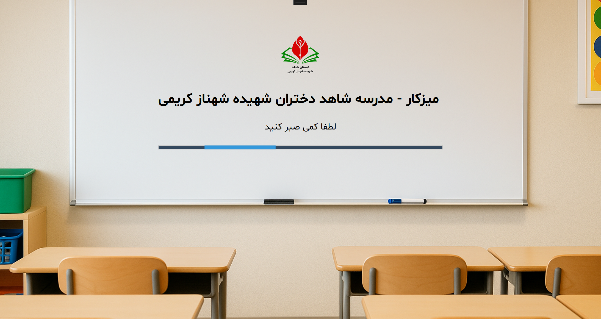 |
| **Main Screen** | Fullscreen navigation with Persian/English options<br>Login, About Us, Contact Us, and Exit buttons | 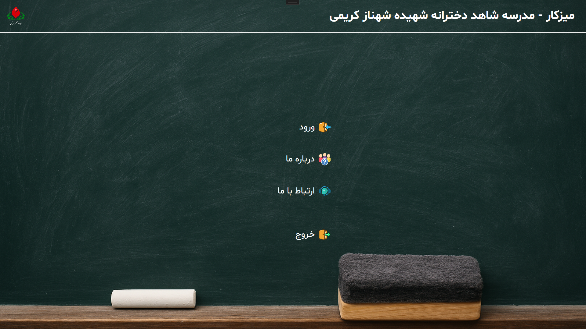 |
| **Category Screen** | 3x3 grid layout with 9 main categories<br>Category selection for organized folder management | 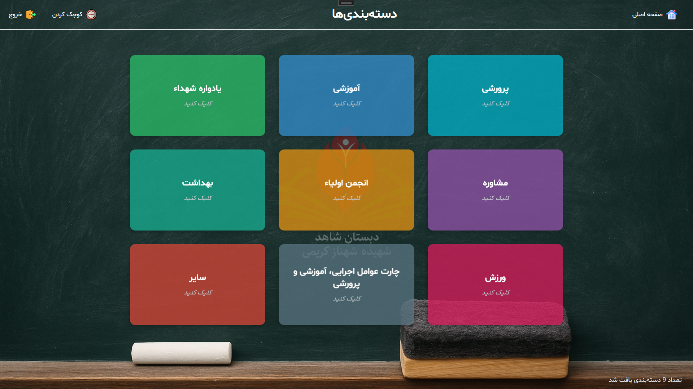 |
| **Folder Management** | 4-row optimized display with RTL alignment<br>Category-specific folders with real-time updates | 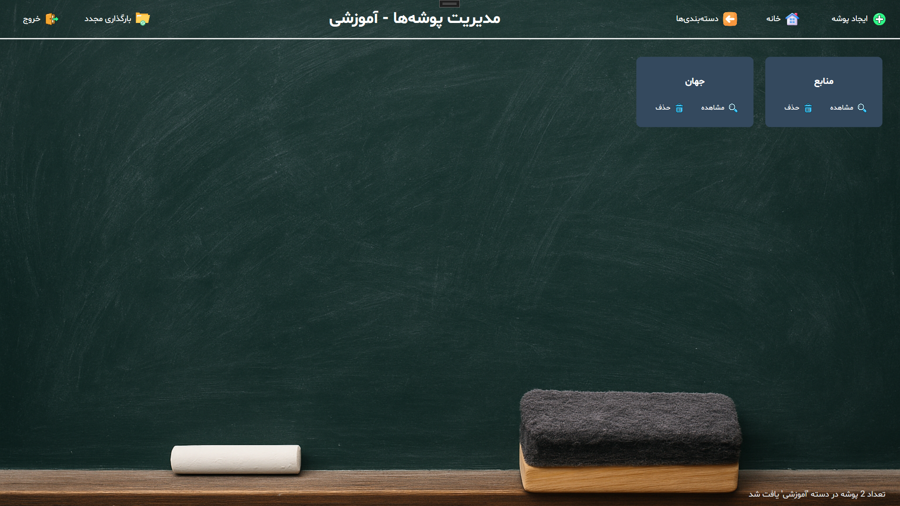 |
| **Empty State** | User-friendly message when no folders exist<br>Clear guidance to create first folder | 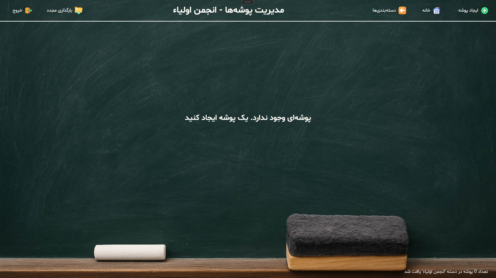 |
| **Image Display** | Chart category with image upload capability<br>Fullscreen viewer for uploaded images | 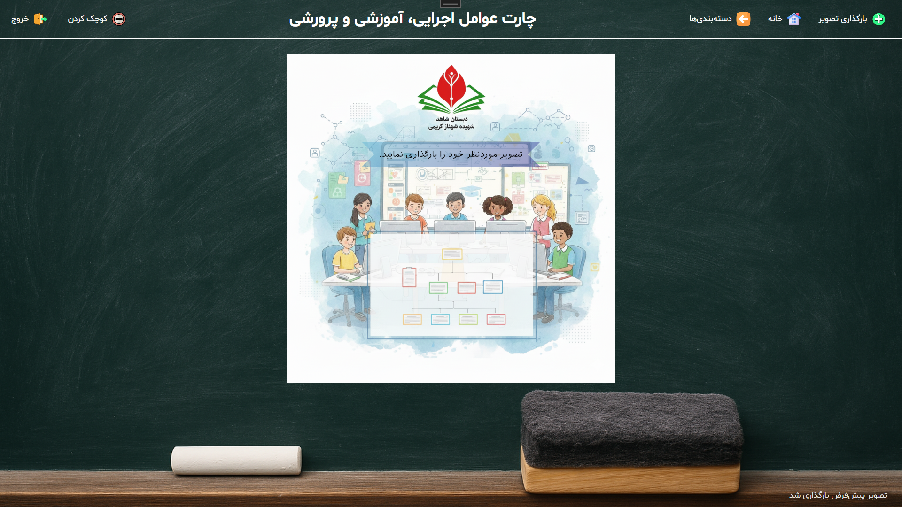 |

### Dialog Examples

| Dialog Type | Description | Screenshot |
|-------------|-------------|------------|
| **Create Folder** | Persian input validation with visual feedback<br>Real-time character validation | 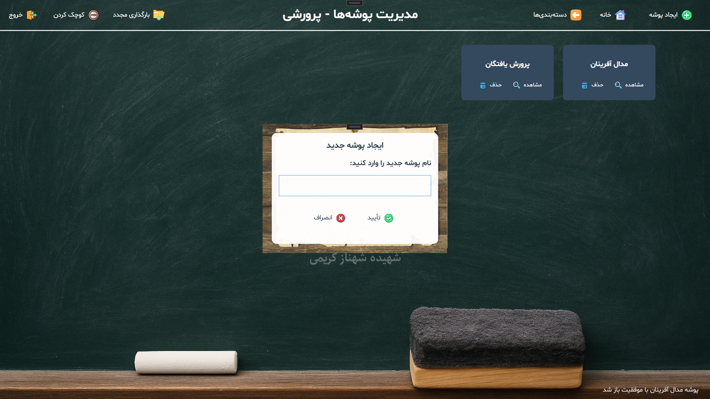 |
| **Delete Confirmation** | Safety confirmation for folder deletion<br>Clear information about folder being deleted | 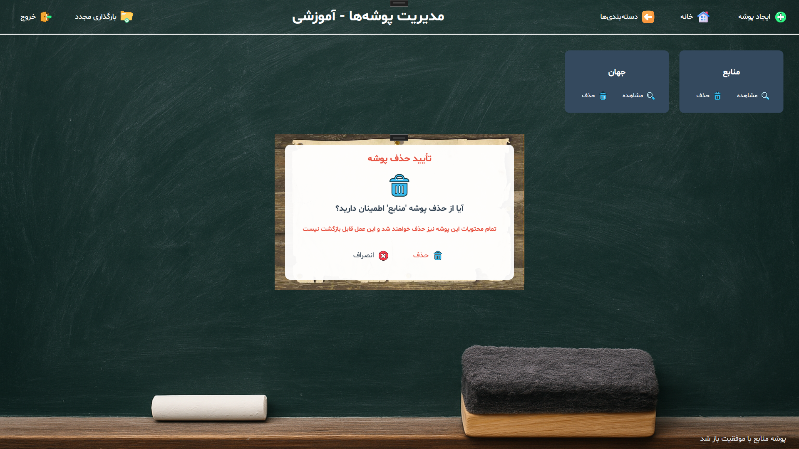 |
| **About Us** | Application information and features<br>Professional Persian-styled interface | 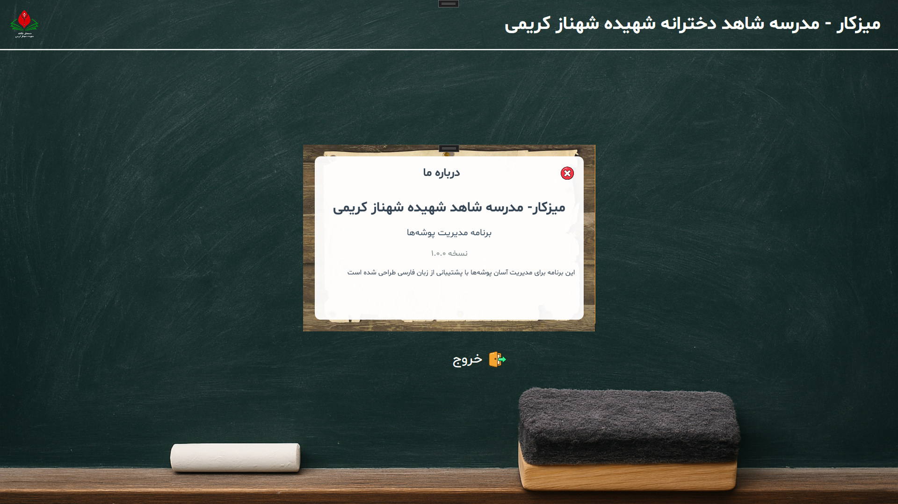 |
| **Contact Us** | Support information and contact details<br>Clean, readable design |  |
| **Error Handling** | User-friendly error messages in Persian<br>Consistent with application theme | 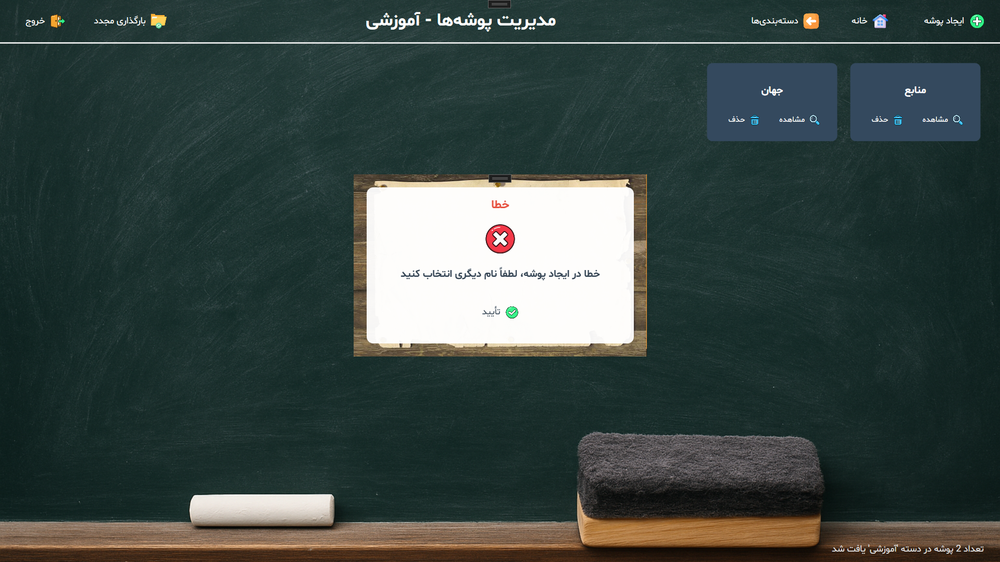 |
| **Image Upload** | File selection dialog for chart images<br>Real-time status updates | 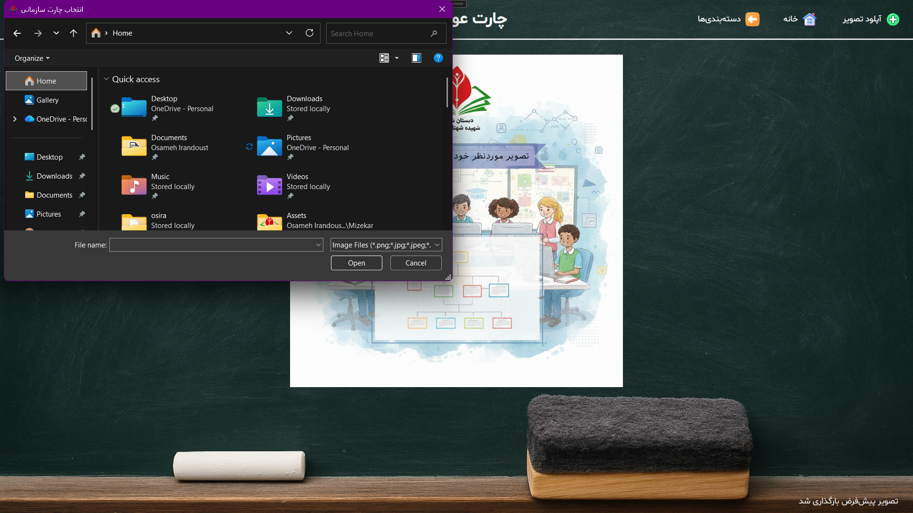 |
| **Input Validation** | Real-time character validation<br>Visual indicators for valid/invalid input | 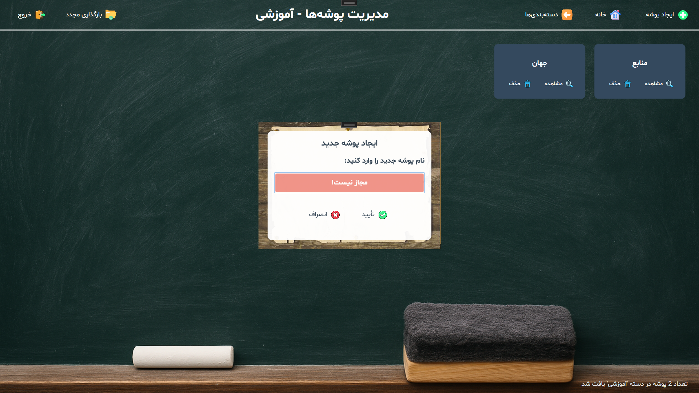 |


## 🛠️ Technology Stack

- **Framework**: .NET 8.0
- **UI**: WPF (Windows Presentation Foundation)
- **Platform**: Windows Desktop
- **Language**: C# 12.0

## 📁 Project Structure

```
MizeKar/
├── Views/                 # XAML windows and dialogs
│   ├── SplashScreen.xaml  # 2-second splash screen
│   ├── MainScreen.xaml    # Main navigation screen
│   ├── CategoryScreen.xaml # Category selection screen (3x3 grid)
│   ├── FolderManagementScreen.xaml  # Folder management interface
│   ├── AboutUsDialog.xaml # About information dialog
│   ├── ContactUsDialog.xaml # Contact information dialog
│   ├── CreateFolderDialog.xaml # Folder creation dialog
│   ├── DeleteConfirmDialog.xaml # Folder deletion confirmation
│   ├── ErrorDialog.xaml   # Error message display
│   ├── ImageDisplayScreen.xaml # Image display for chart category
│   └── ImageFullscreenWindow.xaml # Fullscreen image viewer
├── Models/                # Data models
│   └── FolderInfo.cs      # Folder data model
├── Services/              # Business logic
│   ├── FolderService.cs   # File system operations and watcher
│   └── FontManager.cs     # Font management and Persian text support
├── Assets/                # Application assets
│   ├── fonts/             # Font files
│   │   └── Shabnam/       # Shabnam Persian font family
│   ├── images/            # Background images
│   │   ├── background.png # Main application background
│   │   ├── splash.png     # Splash screen background
│   │   ├── dialog-background.jpg # Dialog window background
│   │   └── chart.png      # Default chart image for display
│   └── icons/             # Application icons
│       ├── about-us.png, add-folder.png, close.png, confirm.png
│       ├── contact-us.png, enter.png, exit.png, home.png
│       ├── remove.png, setting.png, stat.png, view.png
│       ├── refresh.png, categories.png
│   └── logo.ico           # Application icon for Windows
├── docs/                  # Documentation and resources
│   ├── BUILD_INSTRUCTIONS.md  # Detailed build instructions
│   └── Screenshots/       # Application screenshots
│       ├── splash-screen.png, main.png, category.png
│       ├── folders.png, empty-folders.png, charts.png
│       ├── add-folder.png, remove-folder.png, upload-chart.png
│       ├── about-us.png, contact-us.png, error.png
│       └── validate-name.png
├── App.xaml               # Application entry point
├── MizeKar.csproj         # Project configuration
└── MizeKar.sln            # Solution file
```

## 🚀 Getting Started

### Prerequisites

- Windows 10 or later
- .NET 8.0 SDK or later
- Visual Studio 2022 or Visual Studio Code (recommended)

### Building the Application

#### Using Visual Studio

1. Open `MizeKar.sln` in Visual Studio
2. Build the solution (Ctrl+Shift+B)
3. Run the application (F5)

#### Using Command Line

```bash
# Navigate to the project directory
cd MizeKar

# Restore dependencies
dotnet restore

# Build the application
dotnet build

# Run the application
dotnet run
```

### Creating a Release Build

```bash
# Create release build
dotnet build -c Release

# Publish as self-contained executable
dotnet publish -c Release -r win-x64 --self-contained
```

## 📋 Usage

### Splash Screen

- Application starts with a 2-second splash screen
- Automatically transitions to main screen

### Main Navigation

- **ورود (Login)** - Opens category selection screen
- **درباره ما (About Us)** - Shows application information
- **ارتباط با ما (Contact Us)** - Shows contact information
- **خروج (Exit)** - Closes the application

### Category Selection

- **9 Main Categories** - Pre-defined categories in 3x3 grid layout
- **Category Access** - Click any category to manage its folders
- **Structured Hierarchy** - All folders are organized under categories

### Folder Management

- **Data Folder**: Application creates a "Data" folder in the application directory
- **Category-Based**: Folders are created within selected categories only
- **Persian Support**: Full support for Persian folder names using UTF-8 encoding
- **Input Validation**: Only Persian characters, numbers, hyphen (-), and underscore (_) allowed
- **Real-time Updates**: UI updates immediately when folders are added or deleted
- **Empty State Messages**: Clear "پوشه‌ای وجود ندارد. یک پوشه ایجاد کنید" message when no folders exist
- **Folder Operations**:
  - Create new folders with validated Persian names
  - Delete folders with custom confirmation dialog
  - Open folders in Windows Explorer
  - Manual refresh with refresh button

### Image Display System

- **Chart Category**: "چارت عوامل اجرایی، آموزشی و پرورشی" category displays images instead of folders
- **Image Upload**: Click "آپلود تصویر" to upload and replace chart images
- **Fullscreen Viewer**: Click displayed image to view in fullscreen mode
- **Default Chart**: Pre-loaded default chart.png for immediate display
- **Status Updates**: Real-time status messages for image operations

### Keyboard Shortcuts

- `Escape` - Go back to previous screen
- `Ctrl+N` - Create new folder
- `Enter` - Confirm dialog actions
- **Dialog Navigation**: Enter to confirm, Escape to cancel in all dialogs

## 🔧 Configuration

Key configuration constants in `App.xaml.cs`:

- `DATA_FOLDER_NAME = "Data"` - Root data folder name
- `SPLASH_SCREEN_DURATION_MS = 2000` - Splash screen duration

## 🧪 Testing

Test the following features:

1. **Fullscreen behavior** on different screen resolutions
2. **Category navigation** - flow from Main → Categories → Folder Management
3. **Persian folder name** creation with input validation
4. **Input validation** - try typing English characters (should be blocked with visual feedback)
5. **Custom dialogs** - create, delete, and error dialogs
6. **Real-time folder updates** (add/delete folders externally)
7. **Folder operations** (create, delete, open in Explorer)
8. **Manual refresh** - use refresh button to reload folder list
9. **Splash screen timing** and transitions
10. **Right-to-left alignment** in folder management screen
11. **Empty state messages** - verify message appears when categories have no folders
12. **Image display system** - test chart category image upload and fullscreen viewing
13. **Application icon** - verify custom icon appears in Windows taskbar and file explorer

## 🐛 Troubleshooting

- **Build errors**: Ensure .NET 8.0+ is installed
- **File permissions**: Check permissions for Data folder operations
- **Persian fonts**: Verify Persian font support in Windows
- **Clean build**: Try `dotnet clean` then `dotnet build`
- **Input issues**: Only Persian characters, numbers, - and _ are allowed for folder names
- **Animation stuck**: Rapid typing may cause visual feedback to remain - fixed in latest version
- **Image loading**: If chart image doesn't load, rebuild project to ensure assets are copied
- **Icon not showing**: Verify `logo.ico` is included in Assets directory and project file

## 📄 License

This project is licensed under the MIT License - see the LICENSE file for details.

## 🤝 Contributing

1. Fork the project
2. Create a feature branch (`git checkout -b feature/AmazingFeature`)
3. Commit your changes (`git commit -m 'Add some AmazingFeature'`)
4. Push to the branch (`git push origin feature/AmazingFeature`)
5. Open a Pull Request

## 📞 Support

For support and questions:

- Email: osirandoust@gmail.com
- Contact Us: [Telegram](https://t.me/osameh_ir)

## 🔄 Recent Updates

### Version 3.0 - Image Display & Enhanced UX

- **Image Display System**: Special chart category for image upload and display
- **Empty State Handling**: User-friendly messages for categories with no folders
- **Custom Application Icon**: Professional icon for Windows integration
- **Fullscreen Image Viewer**: Click images to view in fullscreen mode
- **Asset Management**: All images and icons properly copied to output directory

### Version 2.0 - Category System & Enhanced UI

- **Category-Based Organization**: 9 main categories in 3x3 grid layout
- **Custom Persian Dialogs**: Professional dialogs for all user interactions
- **Input Validation**: Persian-only input with visual feedback
- **Right-to-Left Layout**: Natural Persian reading direction
- **4-Row Display**: Optimized folder management interface
- **Manual Refresh**: Refresh button for immediate updates
- **Enhanced Navigation**: Improved screen transitions and navigation

### Technical Improvements

- **File System Watcher**: Category-specific monitoring
- **Animation System**: Smooth visual feedback for user actions
- **Error Handling**: Comprehensive error management with custom dialogs
- **Input Security**: Protected against invalid character input
- **Asset Deployment**: Automatic copying of all assets to output directory

## 🗂️ Related Projects

- [Project Documentation](./docs/)
- [Build Instructions](./docs/BUILD_INSTRUCTIONS.md)
- [Application Screenshots](./docs/Screenshots/)

---

**MizeKar** - مدیریت آسان پوشه‌ها با پشتیبانی فارسی
